# Post-contenido — Unidad 8: Patrones Arquitectónicos II

**Clean Architecture y análisis costo-beneficio de CQRS/Event Sourcing**


## Descripción

Repositorio del post-contenido de la Unidad 8 de Patrones de Diseño de Software. Es un sistema de seguimiento de **hallazgos de auditoría interna**. La Parte 1 lo implementa con **Clean Architecture** y la Parte 2 lo extiende, sobre el mismo proyecto Spring Boot, con dos requisitos del comité de auditoría:

- **Dashboard consolidado:** número de hallazgos por severidad, número de hallazgos por estado y promedio de días entre la detección y el cierre, agrupado por área responsable.
- **Trazabilidad legal:** reconstrucción cronológica de cada cambio de estado de un hallazgo, sin que ese registro pueda alterarse retroactivamente.

Antes de implementar la Parte 2 se hizo un análisis costo-beneficio explícito de CQRS y Event Sourcing. Sus conclusiones están en este README, y la implementación sigue lo que el análisis concluye.

---

## Estructura del proyecto

```
meza-post1-u8/
├── pom.xml
├── README.md
├── docs/capturas/                          ← evidencia de los endpoints (curl)
└── src/
    ├── main/java/com/example/auditoria/
    │   ├── domain/                         ← CÍRCULO 1: Entities (Java puro)
    │   │   ├── entity/
    │   │   │   └── HallazgoAuditoria.java          Aggregate Root con máquina de estados
    │   │   └── valueobject/
    │   │       ├── HallazgoId.java                 identidad tipada (UUID)
    │   │       ├── Severidad.java                  enum simple
    │   │       ├── EstadoHallazgo.java             enum con comportamiento (transiciones)
    │   │       ├── PlanRemediacion.java            Value Object inmutable embebido
    │   │       └── TransicionInvalidaException.java
    │   ├── usecase/                        ← CÍRCULO 2: Use Cases (sin Spring)
    │   │   ├── RegistrarHallazgoUseCase.java · IniciarRemediacionUseCase.java
    │   │   ├── CerrarHallazgoUseCase.java · ReabrirHallazgoUseCase.java
    │   │   ├── ConsultarHallazgoUseCase.java · HallazgoNotFoundException.java
    │   │   ├── ObtenerDashboardAuditoriaUseCase.java      (Parte 2)
    │   │   ├── ConsultarHistorialUseCase.java             (Parte 2)
    │   │   ├── port/
    │   │   │   ├── HallazgoRepositoryPort.java            (extendido en la Parte 2)
    │   │   │   ├── HistorialAuditoriaPort.java            (Parte 2)
    │   │   │   └── ConteoCategoria · PromedioCategoria · DashboardAuditoriaView · CambioEstadoView
    │   │   └── impl/                              implementaciones de cada caso de uso
    │   ├── adapter/                        ← CÍRCULO 3: Interface Adapters
    │   │   ├── in/web/
    │   │   │   ├── HallazgoController.java · GlobalExceptionHandler.java
    │   │   │   └── dto/  (Requests, HallazgoResponse, ErrorResponse)
    │   │   └── out/persistence/
    │   │       ├── HallazgoJpaEntity · HallazgoJpaRepository · HallazgoRepositoryAdapter
    │   │       └── HistorialCambioEstadoJpaEntity · HistorialCambioEstadoJpaRepository · HistorialAuditoriaAdapter  (Parte 2)
    │   ├── config/                         ← CÍRCULO 4: Frameworks & Drivers (wiring)
    │   │   ├── AuditoriaConfiguration.java        wiring explícito de los casos de uso
    │   │   └── TransaccionalUseCaseFactory.java   límites transaccionales sin tocar usecase/
    │   └── AuditoriaHallazgosApplication.java
    └── test/java/com/example/auditoria/
        ├── domain/entity/HallazgoAuditoriaTest.java         dominio sin @SpringBootTest
        ├── domain/valueobject/EstadoHallazgoTest.java       las 12 combinaciones de transición
        └── adapter/in/web/HallazgoControllerIntegrationTest.java
```


---

## Parte 1 — Clean Architecture (Hallazgos de Auditoría)

El proyecto organiza los **cuatro círculos concéntricos**:

| Círculo | Paquete | Responsabilidad |
|---|---|---|
| **Entities** | `domain/` | `HallazgoAuditoria` es el Aggregate Root. Su estado solo cambia mediante métodos de dominio (`iniciarRemediacion`, `cerrar`, `reabrir`) que validan la máquina de estados de `EstadoHallazgo`. No tiene setters ni anotaciones de framework. |
| **Use Cases** | `usecase/` | Una interfaz por caso de uso (registrar, iniciar remediación, cerrar, reabrir, consultar) y su implementación en `impl/`. Los puertos de salida (`port/`) definen lo que el caso de uso necesita de la persistencia, sin saber cómo se implementa. |
| **Interface Adapters** | `adapter/` | `HallazgoController` traduce HTTP ↔ casos de uso usando DTOs propios. `HallazgoRepositoryAdapter` traduce, campo a campo, entre `HallazgoJpaEntity` y el agregado de dominio. |
| **Frameworks & Drivers** | `config/` + Spring Boot | `AuditoriaConfiguration` ensambla explícitamente los casos de uso (son clases Java puras, sin `@Service`) y los envuelve en transacciones. Spring MVC, Hibernate y H2 son detalles reemplazables. |


## Parte 2 — Análisis costo-beneficio de CQRS/Event Sourcing

Los dos requisitos nuevos son el tipo de necesidad que la guía usa para presentar CQRS (lecturas con forma muy distinta a las escrituras) y Event Sourcing (reconstruir el historial completo para auditoría). Antes de escribir código se respondieron las cinco preguntas del Paso 8 con los criterios de las Secciones 4.4, 5.5 y 7 de la guía, aplicados a la escala real de este proyecto.

### 1. Escala y carga

*¿Cuántos usuarios concurrentes reales tendrá el sistema? ¿Hay una diferencia de escala entre lecturas y escrituras que justifique infraestructura separada?*

En este laboratorio hay **un solo usuario**: la desarrolladora que ejecuta las pruebas. En el escenario de negocio (ficticio), los usuarios son los auditores internos que registran y actualizan hallazgos, y el comité de auditoría, de unas pocas personas, que consulta el dashboard **una vez al mes** antes de su reunión. El volumen esperado son decenas o, como mucho, algunos cientos de hallazgos por año, con unas pocas transiciones de estado por hallazgo.

La Sección 4.4 justifica CQRS cuando lecturas y escrituras tienen cargas tan distintas que necesitan escalar de forma independiente. Aquí ocurre lo contrario: ambas cargas son mínimas y del mismo orden. Una única base de datos relacional atiende sin esfuerzo unos cientos de filas y una consulta agregada mensual, así que **no hay asimetría de escala que justifique infraestructura separada**.

### 2. Complejidad de las consultas

*¿Los conteos y promedios del dashboard requieren un modelo de lectura con tecnología distinta, o se resuelven con JPQL y GROUP BY sobre el mismo esquema?*

El dashboard son **tres consultas agregadas sobre una sola tabla** (`hallazgos`), sin joins ni desnormalización:

| Métrica | Consulta (JPQL) |
|---|---|
| Hallazgos por severidad | `SELECT h.severidad, COUNT(h) … GROUP BY h.severidad` |
| Hallazgos por estado | `SELECT h.estado, COUNT(h) … GROUP BY h.estado` |
| Promedio de días de cierre por área | `SELECT h.areaResponsable, AVG(DATEDIFF(DAY, h.fechaDeteccion, h.fechaCierre)) … WHERE h.estado = 'CERRADO' GROUP BY h.areaResponsable` |

Las tres se implementaron como `@Query` con **interface projections** de Spring Data JPA en el mismo `HallazgoJpaRepository`. El campo `fechaCierre` ya existía desde la Parte 1 (`HallazgoAuditoria.cerrar()`), así que el promedio no exigió **ningún cambio en el dominio**. No hace falta otra base de datos, otro esquema, búsqueda de texto completo ni vistas materializadas.

### 3. Consistencia

*¿El comité necesita el dashboard en tiempo real, o es aceptable (incluso esperable) que refleje el estado al momento de la consulta, como cualquier reporte bajo demanda?*

El comité revisa el dashboard **bajo demanda, antes de una reunión mensual**. Le basta, y es lo esperable, que el reporte refleje el estado en el momento de la consulta. Al consultar directamente la tabla que el modelo de escritura mantiene, el dashboard obtiene **consistencia fuerte sin costo adicional**: lo que se lee es exactamente lo último que se guardó.

Un CQRS completo con un modelo de lectura separado, alimentado por proyecciones, introduciría **consistencia eventual** (una ventana en la que el dashboard no refleja las últimas transiciones), además de mecanismos de sincronización y reprocesamiento. Aquí eso sería un costo sin ningún beneficio a cambio.

### 4. Naturaleza de la trazabilidad exigida

*¿Cumplimiento necesita reconstruir el ESTADO completo del hallazgo reproduciendo eventos uno por uno (Event Sourcing), o le basta una bitácora cronológica que coexista con el estado actual?*

Cumplimiento pide reconstruir **cronológicamente cada cambio de estado**: de qué estado a qué estado, cuándo y por qué motivo, sin que el registro pueda alterarse. Es una **bitácora de auditoría**, no la fuente de verdad del estado. Nadie necesita saber "qué título tenía el hallazgo el 15 de agosto" ni reproducir estados intermedios para recalcular el agregado.

La Sección 5.5 señala que Event Sourcing aporta replay, consultas temporales y proyecciones nuevas a posteriori. A cambio exige diseñar y **versionar eventos**, manejar snapshots, reconstruir el agregado en cada lectura y asumir consistencia eventual en las vistas. Para lo que Cumplimiento pide basta una tabla **append-only** (`historial_cambios_estado`) escrita **en la misma transacción** que cada transición. `HallazgoJpaEntity` sigue siendo la única fuente del estado actual.

> Sobre el "quién": el laboratorio no tiene autenticación, así que el origen del cambio queda en el campo `motivo` (por ejemplo, *"Inicio de remediacion - responsable: Equipo de Infraestructura"*). Cuando el sistema incorpore Spring Security, bastará con añadir una columna `usuario` a la bitácora, sin cambiar la arquitectura.

### 5. Señales de sobre-ingeniería (Sección 7.2)

*¿Hay un experto de negocio disponible para el modelado de eventos? ¿El equipo tiene experiencia previa con Event Sourcing? ¿El costo de dos modelos separados es proporcional al problema?*

- **Experto de negocio para modelar eventos:** no hay. El comité y el área de Cumplimiento son ficticios y nadie puede validar un catálogo de eventos de dominio ni su evolución.
- **Experiencia del equipo:** el equipo es **una persona** sin experiencia previa en Event Sourcing en producción. El riesgo de modelar mal los eventos, que luego son inmutables, es alto.
- **Proporcionalidad del costo:** CQRS + Event Sourcing completos implicarían un event store, una clase por evento, la reconstrucción del agregado por replay, proyectores hacia un modelo de lectura y un repositorio de lectura separado, además de pruebas de sincronización y de reproceso. La extensión liviana resolvió ambos requisitos con **12 archivos nuevos, todos pequeños, y cambios puntuales en 8 existentes, sin tocar el dominio**.
- **Requisitos futuros conocidos:** no hay proyecciones adicionales previstas. Construir infraestructura "por si acaso" va contra YAGNI.

Las cuatro son señales de sobre-ingeniería que la Sección 7.2 recomienda evitar.

### Resumen costo-beneficio

| Criterio | CQRS + Event Sourcing completos | Extensión liviana (implementada) |
|---|---|---|
| Cumple el dashboard | Sí, mediante proyecciones | Sí, con 3 consultas JPQL `GROUP BY` |
| Cumple la trazabilidad | Sí: los eventos son la fuente de verdad | Sí: bitácora append-only en la misma transacción |
| Consistencia del dashboard | Eventual | Fuerte |
| Cambios en el dominio | Reescribir el agregado para emitir y aplicar eventos | Ninguno |
| Infraestructura nueva | Event store, proyectores, modelo de lectura | Una tabla (`historial_cambios_estado`) |
| Riesgo y curva de aprendizaje | Alto (versionado de eventos, replay, snapshots) | Bajo (JPA estándar) |
| Reversibilidad | Difícil de deshacer | La bitácora puede alimentar una migración futura a ES |

### Conclusión del análisis

**CQRS y Event Sourcing completos no se justifican** a la escala de este proyecto: un desarrollador, sin usuarios concurrentes reales, con consultas agregadas triviales sobre una tabla y una trazabilidad que pide una bitácora y no reconstruir estado. Se implementó la **extensión liviana**: se extendió el mismo `HallazgoRepositoryPort` (y `HallazgoJpaRepository`) con proyecciones de lectura, sin crear un stack de lectura separado, y se agregó un `HistorialAuditoriaPort` con su adaptador y su entidad JPA append-only. Ambas piezas respetan los mismos círculos de la Parte 1.

---

## Decisiones de diseño

### 1. `Severidad` como enum simple vs. `EstadoHallazgo` como enum con máquina de estados

`EstadoHallazgo` encapsula una **regla de negocio real**: qué transiciones son válidas (`ABIERTO → EN_REMEDIACION → CERRADO → REABIERTO → EN_REMEDIACION`). Por eso tiene comportamiento (`puedeTransicionarA(...)`) y es el único lugar del sistema que decide si una transición está permitida. Si esa regla viviera en los servicios o en el controlador, se dispersaría y sería fácil saltársela.

`Severidad` (`CRITICA`, `ALTA`, `MEDIA`, `BAJA`) es solo una **clasificación**. Ninguna severidad es "más válida" que otra, no restringe operaciones ni cambia con el tiempo. Darle comportamiento sería añadir complejidad sin regla que proteger. Se reconsideraría si apareciera una política que dependa de ella, por ejemplo un plazo máximo de remediación por severidad (`CRITICA` ≤ 15 días). En ese caso `Severidad` ganaría un método como `plazoMaximo()`.

### 2. `PlanRemediacion` como Value Object embebido vs. agregado separado

La invariante del negocio dice que un hallazgo **no puede pasar a `EN_REMEDIACION` sin un plan válido ni cerrarse sin uno ya definido**. Según el criterio de **límite de consistencia transaccional** de Bounded Contexts y Agregados (Sección 3.3 de la guía), todo lo que debe cumplir una invariante en la misma transacción pertenece al mismo agregado.

Si `PlanRemediacion` fuera un agregado independiente con su propio repositorio (referenciado por `HallazgoId`), habría dos escrituras en dos agregados y una ventana en la que el hallazgo estaría `EN_REMEDIACION` sin plan persistido, o al revés. Como Value Object inmutable (`record` con validación en el constructor compacto) embebido en `HallazgoAuditoria`, el plan y el cambio de estado se validan y se guardan juntos en una sola operación atómica. En la base de datos se mapea a columnas de la misma tabla (`planResponsable`, `planFechaLimite`, `planNotas`).

### 3. CQRS/Event Sourcing completos vs. extensión liviana del repositorio existente

Aplicando los criterios de la Sección 7 (escala, complejidad de consultas, consistencia y naturaleza de la trazabilidad), desarrollados en la [Parte 2](#parte-2--análisis-costo-beneficio-de-cqrsevent-sourcing):

- La carga es mínima y simétrica, así que no hay nada que escalar por separado (Sección 4.4).
- Las consultas del dashboard son `GROUP BY` sobre el mismo esquema.
- El comité acepta, y espera, un reporte bajo demanda, y la lectura directa da consistencia fuerte.

Por eso **se extendió el mismo `HallazgoRepositoryPort`** con `contarPorSeveridad()`, `contarPorEstado()` y `promedioDiasCierrePorArea()`, implementados con *interface projections* en el mismo `HallazgoJpaRepository`. No se creó un repositorio ni un modelo de lectura separados. El caso de uso `ObtenerDashboardAuditoriaUseCase` sigue dependiendo solo del puerto, de modo que si algún día hiciera falta un modelo de lectura dedicado, solo cambiaría el adaptador.

### 4. Bitácora simple (`HistorialCambioEstado`) vs. Event Store completo

Un Event Store exigiría que `HallazgoAuditoria` dejara de persistir su estado actual y lo reconstruyera por replay en cada lectura. Sería un cambio de fondo sobre un agregado que ya funciona, sin una necesidad real de reproducir estados intermedios. Las **señales de sobre-ingeniería de la Sección 7.2** están todas presentes: no hay experto de negocio para modelar eventos, el equipo no tiene experiencia previa con Event Sourcing y el costo de dos modelos no es proporcional al problema.

La bitácora implementada:

- Se escribe en la **misma transacción** que la transición. Los servicios llaman a `historial.registrar(...)` justo después de `repo.guardar(...)`, usando el estado anterior que devuelve el método de dominio, y cada caso de uso se ejecuta dentro de una transacción definida en `config/`. Si falla la bitácora, se revierte el cambio de estado, y al revés.
- Es **append-only por diseño**. `HistorialCambioEstadoJpaRepository` extiende `Repository` (no `JpaRepository`) y expone solo `save` y `findBy…`, así que **no existe ningún método de actualización o borrado**. La entidad no tiene setters, sus columnas son `updatable = false` y está marcada `@Immutable`.
- **Coexiste** con el estado actual. `HallazgoJpaEntity` sigue siendo la única fuente del estado y `HistorialCambioEstadoJpaEntity` nunca se usa para reconstruir el agregado.
- Solo registra transiciones **exitosas**. Una transición rechazada (400) no deja rastro, como muestra la captura 14.

### Decisiones complementarias de implementación

| Decisión | Motivo |
|---|---|
| `HallazgoAuditoria.reconstituir(...)` para rehidratar desde la base de datos | Reproducir transiciones al cargar (`iniciarRemediacion()` → `cerrar()`) sobrescribiría la `fechaCierre` real con la fecha de la lectura y rompería el promedio del dashboard. La fábrica restaura el estado persistido tal cual, sin exponer setters. |
| `ConsultarHallazgoUseCase` devuelve el agregado y el controlador lo mapea a `HallazgoResponse` | Si el caso de uso devolviera un DTO del paquete `adapter`, la dependencia apuntaría hacia afuera y violaría la regla de dependencia. |
| Transacciones mediante `TransaccionalUseCaseFactory` en `config/` | Garantiza la atomicidad estado + bitácora sin poner `@Transactional` (Spring) dentro de `usecase/`. |
| `DATEDIFF(DAY, …)` en lugar de `DATEDIFF('DAY', …)` | Hibernate 6 traduce `DATEDIFF` a su función estándar `timestampdiff`, que exige la unidad temporal como palabra clave. Con la cadena `'DAY'`, la validación de la consulta falla al arrancar. |
| `HallazgoNotFoundException` → **404**, validación de DTOs con Bean Validation → **400** | Respuestas HTTP coherentes y mensajes de error legibles (`ErrorResponse`). |

---

## Cómo ejecutar

### Requisitos

- **JDK 17** o superior
- **Maven 3.8+**. También se puede usar el wrapper incluido (`mvnw` / `mvnw.cmd`), que no requiere instalar Maven.

### Compilar, probar y levantar

```bash
mvn clean package && mvn spring-boot:run
```

Con el wrapper:

```bash
./mvnw clean package && ./mvnw spring-boot:run          # Linux / macOS / Git Bash
.\mvnw.cmd clean package; .\mvnw.cmd spring-boot:run    # Windows PowerShell
```

La aplicación queda disponible en `http://localhost:8080`.

**Consola H2** (para ver las tablas `hallazgos` e `historial_cambios_estado`): `http://localhost:8080/h2-console`, con JDBC URL `jdbc:h2:mem:auditoriadb`, usuario `sa` y sin contraseña.

### Probar con curl

```bash
# Registrar un hallazgo (201 + hallazgoId)
curl -i -X POST http://localhost:8080/api/hallazgos \
  -H "Content-Type: application/json" \
  -d '{"titulo":"Contraseñas por defecto en servidor de pruebas","descripcion":"El servidor QA usa credenciales por defecto del fabricante","areaResponsable":"Infraestructura","severidad":"ALTA","fechaDeteccion":"2026-08-01"}'

# Iniciar remediación (usar el hallazgoId retornado)
curl -i -X PATCH http://localhost:8080/api/hallazgos/{id}/iniciar-remediacion \
  -H "Content-Type: application/json" \
  -d '{"responsable":"Equipo de Infraestructura","fechaLimite":"2026-08-20","notas":"Rotar credenciales"}'

# Cerrar / reabrir
curl -i -X PATCH http://localhost:8080/api/hallazgos/{id}/cerrar
curl -i -X PATCH http://localhost:8080/api/hallazgos/{id}/reabrir \
  -H "Content-Type: application/json" -d '{"motivo":"El hallazgo reaparecio"}'

# Consultas
curl -i http://localhost:8080/api/hallazgos
curl -i http://localhost:8080/api/hallazgos/{id}
curl -i http://localhost:8080/api/hallazgos/dashboard
curl -i http://localhost:8080/api/hallazgos/{id}/historial
```

> En Windows PowerShell usa `curl.exe` en lugar de `curl`, porque `curl` es un alias de `Invoke-WebRequest`.

---

## Endpoints

| Método | Ruta | Descripción | Respuestas |
|---|---|---|---|
| `POST` | `/api/hallazgos` | Registra un hallazgo (estado inicial `ABIERTO`) | **201** `{"hallazgoId": "<uuid>"}` · 400 |
| `PATCH` | `/api/hallazgos/{id}/iniciar-remediacion` | Asigna el plan y pasa a `EN_REMEDIACION` | 200 · 400 · 404 |
| `PATCH` | `/api/hallazgos/{id}/cerrar` | Pasa a `CERRADO` y registra `fechaCierre` | 200 · 400 · 404 |
| `PATCH` | `/api/hallazgos/{id}/reabrir` | Pasa a `REABIERTO` (requiere `motivo`) | 200 · 400 · 404 |
| `GET` | `/api/hallazgos/{id}` | Consulta un hallazgo | 200 · 404 |
| `GET` | `/api/hallazgos` | Lista todos los hallazgos | 200 |
| `GET` | `/api/hallazgos/dashboard` | Conteos por severidad y estado, y promedio de días de cierre por área *(Parte 2)* | 200 |
| `GET` | `/api/hallazgos/{id}/historial` | Transiciones del hallazgo en orden cronológico *(Parte 2)* | 200 · 404 |

---

## Pruebas automatizadas

`mvn clean package` ejecuta **26 pruebas**, todas en verde:

| Clase | Pruebas | Qué verifica |
|---|---|---|
| `EstadoHallazgoTest` | 12 | Las 12 combinaciones origen → destino de la máquina de estados |
| `HallazgoAuditoriaTest` | 7 | El agregado se instancia y transiciona **sin `@SpringBootTest`**: ciclo completo, rechazo de transiciones inválidas e invariantes de creación y del plan |
| `HallazgoControllerIntegrationTest` | 6 | Checkpoints de ambas partes: 201 con UUID, 400 en transiciones inválidas y JSON inválido, 404, historial de 3 transiciones en orden, totales del dashboard coherentes con los hallazgos y promedio de días exacto |
| `AuditoriaHallazgosApplicationTests` | 1 | El contexto de Spring levanta |

---

## Capturas de los endpoints

Capturas reales de la consola: la aplicación se levantó con `mvn spring-boot:run` y los endpoints se probaron con **curl**. Las imágenes están en [`docs/capturas`](docs/capturas).

### Compilación y arranque

**`mvn clean package`**: 26 pruebas, 0 fallos, BUILD SUCCESS

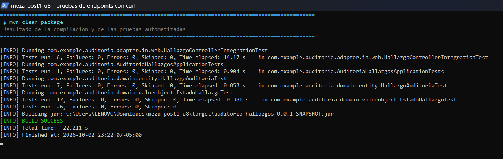

**`mvn spring-boot:run`**: aplicación levantada en el puerto 8080

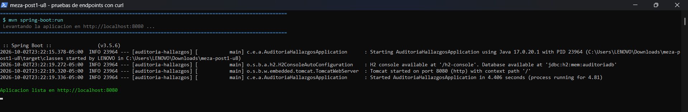

### Parte 1 — Checkpoints del Paso 6

**POST `/api/hallazgos`**: 201 Created con el `hallazgoId` en formato UUID

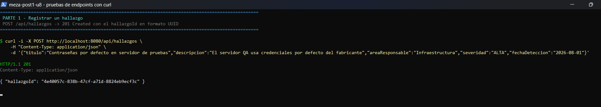

**PATCH `…/iniciar-remediacion`** sobre un hallazgo ABIERTO: 200, estado `EN_REMEDIACION`

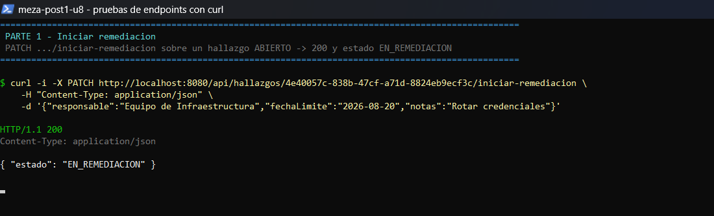

**PATCH `…/cerrar`** sobre un hallazgo ABIERTO (sin plan): **400 Bad Request**

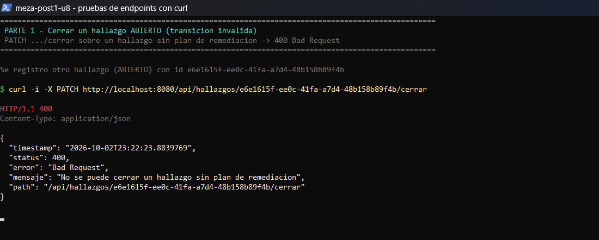

**PATCH `…/cerrar`** sobre un hallazgo EN_REMEDIACION: 200, estado `CERRADO`

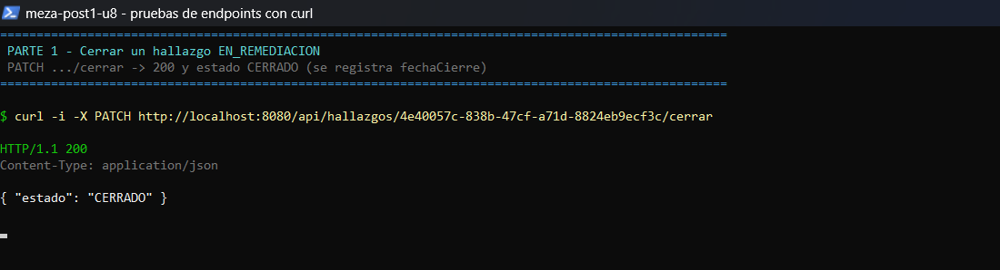

**PATCH `…/reabrir`** sobre un hallazgo CERRADO: 200, estado `REABIERTO`

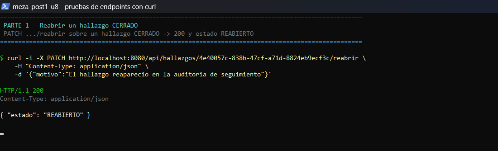

**PATCH `…/reabrir`** sobre un hallazgo ABIERTO: **400**, transición rechazada por `EstadoHallazgo`

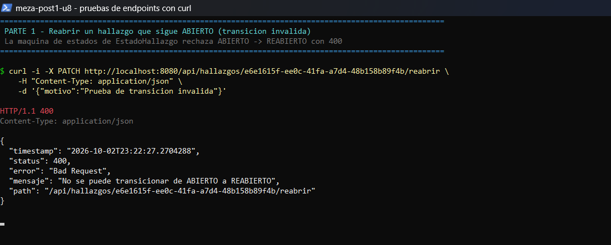

**GET `/api/hallazgos/{id}`**: 200, con el plan de remediación embebido

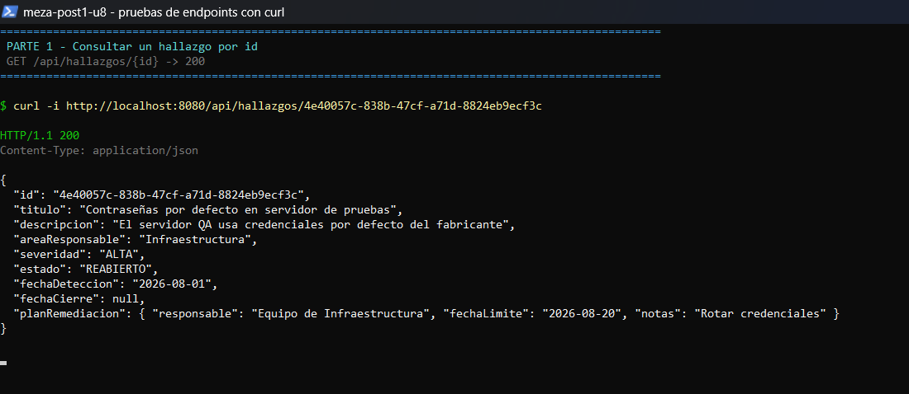

**GET `/api/hallazgos`**: 200, lista de hallazgos

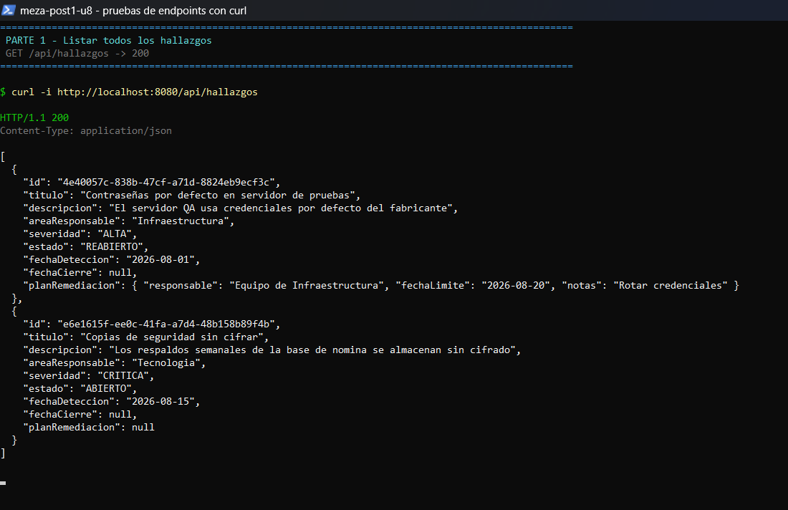

**GET `/api/hallazgos/{id}`** con un UUID inexistente: **404 Not Found**

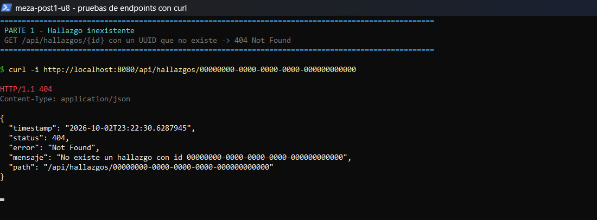

### Parte 2 — Checkpoints del Paso 11

**Datos de prueba**: hallazgos de varias áreas y severidades, con sus ciclos completados mediante los endpoints de la Parte 1

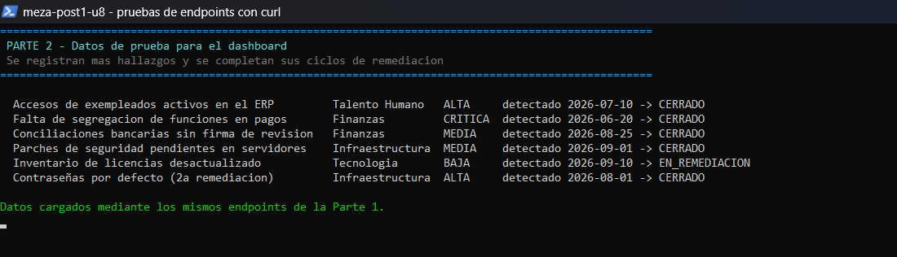

**GET `/api/hallazgos/dashboard`**: conteos por severidad y estado, y promedio de días de cierre por área. Los números cuadran con los datos registrados (7 hallazgos en total). Por ejemplo, Finanzas: (104 + 38) / 2 = **71,0** días.

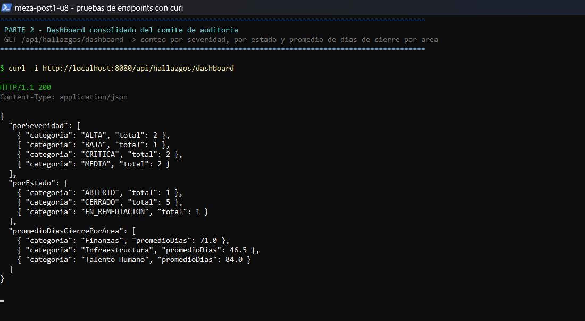

**GET `/api/hallazgos/{id}/historial`**: las 5 transiciones del hallazgo en orden cronológico (ABIERTO → EN_REMEDIACION → CERRADO → REABIERTO → EN_REMEDIACION → CERRADO)

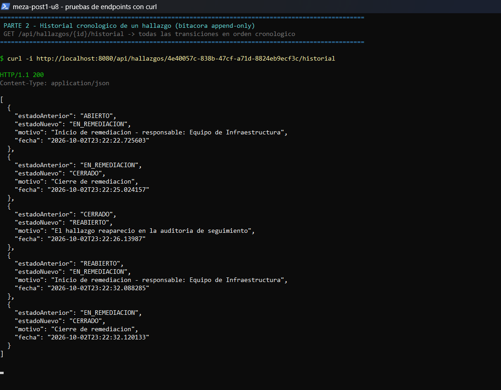

**GET `/api/hallazgos/{id}/historial`** de un hallazgo cuyas transiciones fueron rechazadas: lista vacía, porque los 400 no escriben en la bitácora

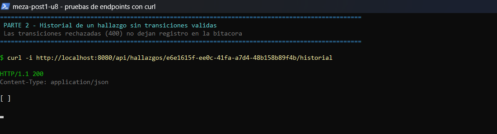

---

## Herramientas utilizadas

- Java 17 (Eclipse Temurin), Spring Boot 3.5.6, Spring Web, Spring Data JPA (Hibernate 6.6), Bean Validation, H2 Database
- Apache Maven (con Maven Wrapper), JUnit 5, AssertJ, MockMvc
- curl, Git, GitHub, Visual Studio Code

---

## Conclusiones

Clean Architecture mostró su valor cuando llegaron los requisitos nuevos. Como el dominio era Java puro y los casos de uso dependían de puertos, la Parte 2 se integró **sin modificar una sola línea de `domain/`**: se extendió un puerto existente, se agregó otro y se escribieron sus adaptadores. Modelar `EstadoHallazgo` con comportamiento y `PlanRemediacion` como Value Object embebido hizo que las reglas del negocio se cumplan por construcción, y que también se puedan probar sin levantar Spring.

El análisis costo-beneficio dejó claro que "la necesidad suena a CQRS/Event Sourcing" no basta para adoptarlos. A esta escala, la extensión liviana cumple ambos requisitos con consistencia fuerte y una fracción del costo. Habría que **reconsiderar la decisión** si:

- el volumen de lecturas del dashboard creciera hasta competir con las escrituras (muchos usuarios concurrentes o millones de hallazgos). El primer paso sería un modelo de lectura dedicado (CQRS sin Event Sourcing).
- Cumplimiento exigiera reconstruir el estado completo de un hallazgo en cualquier fecha pasada, o surgieran varios consumidores que reaccionen a los cambios (notificaciones, integración con otros sistemas). Ahí Event Sourcing empezaría a pagar su complejidad, y la bitácora actual serviría como punto de partida para la migración.
