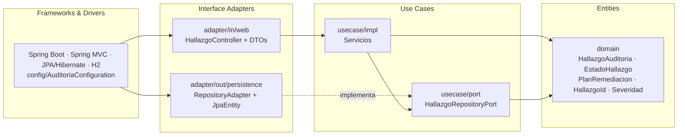
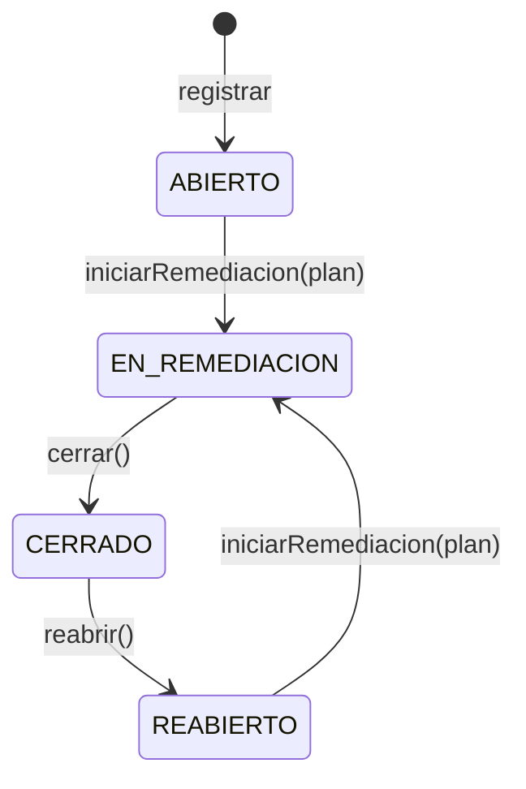

# Post-contenido — Unidad 8: Patrones Arquitectónicos II

**Parte 1: Clean Architecture — Hallazgos de Auditoría Interna**

> Estado del repositorio: **Parte 1 completada**. La Parte 2 (análisis costo-beneficio de CQRS/Event Sourcing, dashboard e historial) se agrega sobre este mismo proyecto.

| | |
|---|---|
| **Autora** | Camila Meza Palacio |
| **Asignatura** | Patrones de Diseño de Software — Unidad 8 |
| **Repositorio** | `meza-post1-u8` (ambas partes, un solo proyecto Spring Boot) |
| **Stack** | Java 17 · Spring Boot 3.5.6 · Spring Data JPA (Hibernate 6.6) · H2 · Maven |

---

## Tabla de contenido

1. [Descripción](#descripción)
2. [Estructura del proyecto](#estructura-del-proyecto)
3. [Parte 1 — Clean Architecture](#parte-1--clean-architecture-hallazgos-de-auditoría)
4. [Decisiones de diseño](#decisiones-de-diseño)
5. [Cómo ejecutar](#cómo-ejecutar)
6. [Endpoints](#endpoints)
7. [Pruebas automatizadas](#pruebas-automatizadas)
8. [Capturas de los endpoints](#capturas-de-los-endpoints)
9. [Herramientas utilizadas](#herramientas-utilizadas)

---

## Descripción

Repositorio del post-contenido de la Unidad 8 de Patrones de Diseño de Software. Es un sistema de seguimiento de **hallazgos de auditoría interna** implementado con **Clean Architecture** y sus cuatro círculos concéntricos: Entities (Aggregate Root con máquina de estados y Value Objects), Use Cases (casos de uso con puertos), Interface Adapters (controller y adaptador de repositorio) y Frameworks & Drivers (Spring Boot + JPA).

---

## Estructura del proyecto

```
meza-post1-u8/
├── pom.xml
├── README.md
├── docs/capturas/                          ← evidencia de los endpoints (curl)
└── src/
    ├── main/java/com/example/auditoria/
    │   ├── domain/                         ← CÍRCULO 1: Entities (Java puro)
    │   │   ├── entity/
    │   │   │   └── HallazgoAuditoria.java          Aggregate Root con máquina de estados
    │   │   └── valueobject/
    │   │       ├── HallazgoId.java                 identidad tipada (UUID)
    │   │       ├── Severidad.java                  enum simple
    │   │       ├── EstadoHallazgo.java             enum con comportamiento (transiciones)
    │   │       ├── PlanRemediacion.java            Value Object inmutable embebido
    │   │       └── TransicionInvalidaException.java
    │   ├── usecase/                        ← CÍRCULO 2: Use Cases (sin Spring)
    │   │   ├── RegistrarHallazgoUseCase.java · IniciarRemediacionUseCase.java
    │   │   ├── CerrarHallazgoUseCase.java · ReabrirHallazgoUseCase.java
    │   │   ├── ConsultarHallazgoUseCase.java · HallazgoNotFoundException.java
    │   │   ├── port/
    │   │   │   └── HallazgoRepositoryPort.java            puerto de salida
    │   │   └── impl/                              implementaciones de cada caso de uso
    │   ├── adapter/                        ← CÍRCULO 3: Interface Adapters
    │   │   ├── in/web/
    │   │   │   ├── HallazgoController.java · GlobalExceptionHandler.java
    │   │   │   └── dto/  (Requests, HallazgoResponse, ErrorResponse)
    │   │   └── out/persistence/
    │   │       └── HallazgoJpaEntity · HallazgoJpaRepository · HallazgoRepositoryAdapter
    │   ├── config/                         ← CÍRCULO 4: Frameworks & Drivers (wiring)
    │   │   ├── AuditoriaConfiguration.java        wiring explícito de los casos de uso
    │   │   └── TransaccionalUseCaseFactory.java   límites transaccionales sin tocar usecase/
    │   └── AuditoriaHallazgosApplication.java
    └── test/java/com/example/auditoria/
        ├── domain/entity/HallazgoAuditoriaTest.java         dominio sin @SpringBootTest
        ├── domain/valueobject/EstadoHallazgoTest.java       las 12 combinaciones de transición
        └── adapter/in/web/HallazgoControllerIntegrationTest.java
```

### Regla de dependencia

Las dependencias del código apuntan solo hacia adentro. `domain/` no conoce a nadie, `usecase/` solo conoce `domain/`, y Spring y JPA viven únicamente en `adapter/` y `config/`.



Verificación (checkpoint de la guía):

```bash
# No debe imprimir nada: domain/ y usecase/ no importan Spring ni JPA
grep -rn "import org.springframework\|import jakarta.persistence" \
     src/main/java/com/example/auditoria/domain src/main/java/com/example/auditoria/usecase
```

---

## Parte 1 — Clean Architecture (Hallazgos de Auditoría)

El proyecto organiza los **cuatro círculos concéntricos**:

| Círculo | Paquete | Responsabilidad |
|---|---|---|
| **Entities** | `domain/` | `HallazgoAuditoria` es el Aggregate Root. Su estado solo cambia mediante métodos de dominio (`iniciarRemediacion`, `cerrar`, `reabrir`) que validan la máquina de estados de `EstadoHallazgo`. No tiene setters ni anotaciones de framework. |
| **Use Cases** | `usecase/` | Una interfaz por caso de uso (registrar, iniciar remediación, cerrar, reabrir, consultar) y su implementación en `impl/`. Los puertos de salida (`port/`) definen lo que el caso de uso necesita de la persistencia, sin saber cómo se implementa. |
| **Interface Adapters** | `adapter/` | `HallazgoController` traduce HTTP ↔ casos de uso usando DTOs propios. `HallazgoRepositoryAdapter` traduce, campo a campo, entre `HallazgoJpaEntity` y el agregado de dominio. |
| **Frameworks & Drivers** | `config/` + Spring Boot | `AuditoriaConfiguration` ensambla explícitamente los casos de uso (son clases Java puras, sin `@Service`) y los envuelve en transacciones. Spring MVC, Hibernate y H2 son detalles reemplazables. |

### Máquina de estados



Cualquier otra transición lanza `TransicionInvalidaException`, o `IllegalStateException` si se intenta cerrar un hallazgo sin plan. `GlobalExceptionHandler` traduce ambas a **HTTP 400**. Así no se puede cerrar un hallazgo que nunca estuvo en remediación ni reabrir uno que sigue abierto.

---

## Decisiones de diseño

### 1. `Severidad` como enum simple vs. `EstadoHallazgo` como enum con máquina de estados

`EstadoHallazgo` encapsula una **regla de negocio real**: qué transiciones son válidas (`ABIERTO → EN_REMEDIACION → CERRADO → REABIERTO → EN_REMEDIACION`). Por eso tiene comportamiento (`puedeTransicionarA(...)`) y es el único lugar del sistema que decide si una transición está permitida. Si esa regla viviera en los servicios o en el controlador, se dispersaría y sería fácil saltársela.

`Severidad` (`CRITICA`, `ALTA`, `MEDIA`, `BAJA`) es solo una **clasificación**. Ninguna severidad es "más válida" que otra, no restringe operaciones ni cambia con el tiempo. Darle comportamiento sería añadir complejidad sin regla que proteger. Se reconsideraría si apareciera una política que dependa de ella, por ejemplo un plazo máximo de remediación por severidad (`CRITICA` ≤ 15 días). En ese caso `Severidad` ganaría un método como `plazoMaximo()`.

### 2. `PlanRemediacion` como Value Object embebido vs. agregado separado

La invariante del negocio dice que un hallazgo **no puede pasar a `EN_REMEDIACION` sin un plan válido ni cerrarse sin uno ya definido**. Según el criterio de **límite de consistencia transaccional** de Bounded Contexts y Agregados (Sección 3.3 de la guía), todo lo que debe cumplir una invariante en la misma transacción pertenece al mismo agregado.

Si `PlanRemediacion` fuera un agregado independiente con su propio repositorio (referenciado por `HallazgoId`), habría dos escrituras en dos agregados y una ventana en la que el hallazgo estaría `EN_REMEDIACION` sin plan persistido, o al revés. Como Value Object inmutable (`record` con validación en el constructor compacto) embebido en `HallazgoAuditoria`, el plan y el cambio de estado se validan y se guardan juntos en una sola operación atómica. En la base de datos se mapea a columnas de la misma tabla (`planResponsable`, `planFechaLimite`, `planNotas`).

### Decisiones complementarias de implementación

| Decisión | Motivo |
|---|---|
| `HallazgoAuditoria.reconstituir(...)` para rehidratar desde la base de datos | Reproducir transiciones al cargar (`iniciarRemediacion()` → `cerrar()`) sobrescribiría la `fechaCierre` real con la fecha de la lectura. La fábrica restaura el estado persistido tal cual, sin exponer setters. |
| `ConsultarHallazgoUseCase` devuelve el agregado y el controlador lo mapea a `HallazgoResponse` | Si el caso de uso devolviera un DTO del paquete `adapter`, la dependencia apuntaría hacia afuera y violaría la regla de dependencia. |
| Transacciones mediante `TransaccionalUseCaseFactory` en `config/` | Cada caso de uso se ejecuta de forma atómica sin poner `@Transactional` (Spring) dentro de `usecase/`. |
| `HallazgoNotFoundException` → **404**, validación de DTOs con Bean Validation → **400** | Respuestas HTTP coherentes y mensajes de error legibles (`ErrorResponse`). |

---

## Cómo ejecutar

### Requisitos

- **JDK 17** o superior
- **Maven 3.8+**. También se puede usar el wrapper incluido (`mvnw` / `mvnw.cmd`), que no requiere instalar Maven.

### Compilar, probar y levantar

```bash
mvn clean package && mvn spring-boot:run
```

Con el wrapper:

```bash
./mvnw clean package && ./mvnw spring-boot:run          # Linux / macOS / Git Bash
.\mvnw.cmd clean package; .\mvnw.cmd spring-boot:run    # Windows PowerShell
```

La aplicación queda disponible en `http://localhost:8080`.

**Consola H2** (para ver la tabla `hallazgos`): `http://localhost:8080/h2-console`, con JDBC URL `jdbc:h2:mem:auditoriadb`, usuario `sa` y sin contraseña.

### Probar con curl

```bash
# Registrar un hallazgo (201 + hallazgoId)
curl -i -X POST http://localhost:8080/api/hallazgos \
  -H "Content-Type: application/json" \
  -d '{"titulo":"Contraseñas por defecto en servidor de pruebas","descripcion":"El servidor QA usa credenciales por defecto del fabricante","areaResponsable":"Infraestructura","severidad":"ALTA","fechaDeteccion":"2026-08-01"}'

# Iniciar remediación (usar el hallazgoId retornado)
curl -i -X PATCH http://localhost:8080/api/hallazgos/{id}/iniciar-remediacion \
  -H "Content-Type: application/json" \
  -d '{"responsable":"Equipo de Infraestructura","fechaLimite":"2026-08-20","notas":"Rotar credenciales"}'

# Cerrar / reabrir
curl -i -X PATCH http://localhost:8080/api/hallazgos/{id}/cerrar
curl -i -X PATCH http://localhost:8080/api/hallazgos/{id}/reabrir \
  -H "Content-Type: application/json" -d '{"motivo":"El hallazgo reaparecio"}'

# Consultas
curl -i http://localhost:8080/api/hallazgos
curl -i http://localhost:8080/api/hallazgos/{id}
```

> En Windows PowerShell usa `curl.exe` en lugar de `curl`, porque `curl` es un alias de `Invoke-WebRequest`.

---

## Endpoints

| Método | Ruta | Descripción | Respuestas |
|---|---|---|---|
| `POST` | `/api/hallazgos` | Registra un hallazgo (estado inicial `ABIERTO`) | **201** `{"hallazgoId": "<uuid>"}` · 400 |
| `PATCH` | `/api/hallazgos/{id}/iniciar-remediacion` | Asigna el plan y pasa a `EN_REMEDIACION` | 200 · 400 · 404 |
| `PATCH` | `/api/hallazgos/{id}/cerrar` | Pasa a `CERRADO` y registra `fechaCierre` | 200 · 400 · 404 |
| `PATCH` | `/api/hallazgos/{id}/reabrir` | Pasa a `REABIERTO` (requiere `motivo`) | 200 · 400 · 404 |
| `GET` | `/api/hallazgos/{id}` | Consulta un hallazgo | 200 · 404 |
| `GET` | `/api/hallazgos` | Lista todos los hallazgos | 200 |

---

## Pruebas automatizadas

`mvn clean package` ejecuta **26 pruebas**, todas en verde:

| Clase | Pruebas | Qué verifica |
|---|---|---|
| `EstadoHallazgoTest` | 12 | Las 12 combinaciones origen → destino de la máquina de estados |
| `HallazgoAuditoriaTest` | 7 | El agregado se instancia y transiciona **sin `@SpringBootTest`**: ciclo completo, rechazo de transiciones inválidas e invariantes de creación y del plan |
| `HallazgoControllerIntegrationTest` | 6 | Checkpoints del Paso 6: 201 con UUID, ciclo completo de transiciones, 400 en transiciones inválidas y JSON inválido, 404 |
| `AuditoriaHallazgosApplicationTests` | 1 | El contexto de Spring levanta |

---

## Capturas de los endpoints

Capturas reales de la consola: la aplicación se levantó con `mvn spring-boot:run` y los endpoints se probaron con **curl**. Las imágenes están en [`docs/capturas`](docs/capturas).

### Compilación y arranque

**`mvn clean package`**: 26 pruebas, 0 fallos, BUILD SUCCESS


**`mvn spring-boot:run`**: aplicación levantada en el puerto 8080


### Parte 1 — Checkpoints del Paso 6

**POST `/api/hallazgos`**: 201 Created con el `hallazgoId` en formato UUID


**PATCH `…/iniciar-remediacion`** sobre un hallazgo ABIERTO: 200, estado `EN_REMEDIACION`


**PATCH `…/cerrar`** sobre un hallazgo ABIERTO (sin plan): **400 Bad Request**


**PATCH `…/cerrar`** sobre un hallazgo EN_REMEDIACION: 200, estado `CERRADO`


**PATCH `…/reabrir`** sobre un hallazgo CERRADO: 200, estado `REABIERTO`


**PATCH `…/reabrir`** sobre un hallazgo ABIERTO: **400**, transición rechazada por `EstadoHallazgo`


**GET `/api/hallazgos/{id}`**: 200, con el plan de remediación embebido


**GET `/api/hallazgos`**: 200, lista de hallazgos


**GET `/api/hallazgos/{id}`** con un UUID inexistente: **404 Not Found**


---

## Herramientas utilizadas

- Java 17 (Eclipse Temurin), Spring Boot 3.5.6, Spring Web, Spring Data JPA (Hibernate 6.6), Bean Validation, H2 Database
- Apache Maven (con Maven Wrapper), JUnit 5, AssertJ, MockMvc
- curl, Git, GitHub, Visual Studio Code
